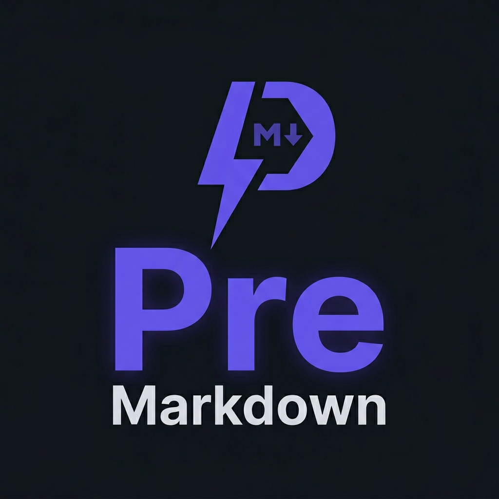

# PreMarkdown

<div align="center">



**高性能 Markdown 引擎** — 基于 [pretext](https://github.com/chenglou/pretext) 零 DOM 重排布局

[](https://github.com/Leo555/pre-markdown/actions/workflows/ci.yml)
[](https://www.npmjs.com/package/@pre-markdown/parser)
[](https://www.npmjs.com/package/@pre-markdown/parser)
[](https://bundlephobia.com/package/@pre-markdown/parser)
[](https://www.typescriptlang.org)
[](https://opensource.org/licenses/MIT)

[English](./README.md) · [简体中文](./README.zh.md) · [📖 在线示例](https://leo555.github.io/pre-markdown/examples/basic.html) · [🚀 性能对标](https://leo555.github.io/pre-markdown/benchmark/) · [API 文档](./docs/api.md)

</div>

---

## 为什么选择 PreMarkdown

> 通过零 DOM 重排布局和增量解析，实现比 marked 快 3 倍、比 markdown-it 快 10 倍的 Markdown 引擎，同时保持 **< 30KB gzip** 的轻量体积。

| 特性 | PreMarkdown | marked | markdown-it | commonmark.js | Cherry |
|------|:---:|:---:|:---:|:---:|:---:|
| **定位** | **性能极致** | 速度型 | 插件丰富 | 规范参考 | 功能全面 |
| **完整 AST** | ✅ | ❌ | ❌ Token | ✅ | ❌ |
| **增量解析** | ✅ < 1ms | ❌ | ❌ | ❌ | ✅ |
| **零 DOM 布局** | ✅ pretext | ❌ | ❌ | ❌ | ❌ DOM |
| **虚拟化滚动** | ✅ | ❌ | ❌ | ❌ | ❌ |
| **Tree-shakeable ESM** | ✅ | ✅ | ✅ | ❌ | ❌ |
| **核心体积** | **18.5KB** | ~12KB | ~30KB | ~20KB | ~700KB |

**[👉 在线性能对标（7 引擎实时对比）](https://leo555.github.io/pre-markdown/benchmark/)**

---

## 快速开始

### 安装

```bash
npm install @pre-markdown/parser @pre-markdown/renderer
```

### 基础用法

```typescript
import { parse } from '@pre-markdown/parser'
import { renderToHtml } from '@pre-markdown/renderer'

const html = renderToHtml(parse('# Hello **World**'))
// → <h1>Hello <strong>World</strong></h1>
```

### 仅获取 AST

```typescript
import { parse } from '@pre-markdown/parser'

const doc = parse('Hello **world**')
// { type: 'document', children: [{ type: 'paragraph', children: [...] }] }
```

### 遍历和查询 AST

```typescript
import { parse } from '@pre-markdown/parser'
import { walk, findAll, getTextContent } from '@pre-markdown/core'

const ast = parse(markdown)

// 深度优先遍历
walk(ast, (node) => {
  if (node.type === 'heading') {
    console.log(`H${node.depth}: ${getTextContent(node.children)}`)
  }
})

// 查找所有链接
const links = findAll(ast, (n) => n.type === 'link')
```

### 安全渲染（XSS 防护）

```typescript
import { renderToHtml } from '@pre-markdown/renderer'

const safeHtml = renderToHtml(ast, {
  sanitize: true  // 默认开启，自动过滤 javascript: 等危险协议
})
```

### 增量解析（实时编辑场景）

```typescript
import { IncrementalParser } from '@pre-markdown/parser'

const parser = new IncrementalParser()
let doc = parser.parse(initialMarkdown)

// 用户编辑第 5 行
doc = parser.update({
  type: 'replace',
  startLine: 5,
  deleteCount: 1,
  insertLines: ['## 新标题', '更新内容']
})
// 仅重解析受影响的块级节点，< 1ms 响应
```

### 布局引擎（零 DOM 测量）

```typescript
import { LayoutEngine } from '@pre-markdown/layout'

const engine = new LayoutEngine({
  font: '14px -apple-system, BlinkMacSystemFont, "Segoe UI", Roboto',
  lineHeight: 1.5,
  maxWidth: 800,
})

const { height, lineCount } = engine.computeLayout(text)
const viewport = engine.computeViewportLayout(text, scrollTop, viewportHeight)
```

---

## 核心特性

| 类别 | 特性 |
|------|------|
| 🔥 **极致性能** | Parse + Render < 0.3ms (1KB)、增量更新 < 1ms、零 DOM 重排、LRU 缓存 |
| 🏗️ **完整 AST** | 结构化 AST + Visitor 模式 + EventBus 事件系统 |
| 🎯 **虚拟化滚动** | 基于 pretext 精确行高，万行文档无卡顿 |
| 📦 **轻量可插拔** | < 30KB gzip、Tree-shakeable ESM、core 包零依赖 |
| 🔒 **安全渲染** | XSS 防护 + URL 协议白名单 + CSS 注入防护 |

---

## 包结构

```
@pre-markdown/core       — AST 类型、Builder、Visitor、EventBus（0 依赖）
@pre-markdown/parser     — Markdown → AST 解析引擎（块级 + 内联 + 增量）
@pre-markdown/renderer   — AST → HTML 渲染器（安全模式、代码高亮 hook）
@pre-markdown/layout     — pretext 布局引擎（零 DOM 测量、LRU 缓存、虚拟化视口）
```

| 场景 | 依赖 | 描述 |
|------|------|------|
| 静态渲染 | parser + renderer | 博客、文档静态生成 |
| 实时编辑器 | parser + renderer + layout | 编辑器、笔记应用 |
| AST 转换 | core + parser | 自定义预处理、lint 工具 |

---

## 示例页面

### 在线体验（GitHub Pages）

| 页面 | 链接 | 说明 |
|------|------|------|
| ⚡ 快速开始 | [在线体验 →](https://leo555.github.io/pre-markdown/examples/quick-start.html) | 最简用法、AST 结构、渲染选项、安全渲染 |
| 🚀 基础用法 | [在线体验 →](https://leo555.github.io/pre-markdown/examples/basic.html) | 解析渲染、AST、安全模式、性能基准 |
| 🌲 AST 遍历 | [在线体验 →](https://leo555.github.io/pre-markdown/examples/ast-walker.html) | walk / findAll / findFirst / getTextContent |
| 🔧 AST 转换 | [在线体验 →](https://leo555.github.io/pre-markdown/examples/ast-transform.html) | Visitor 模式、提取标题链接、文档统计 |
| 🎨 自定义渲染 | [在线体验 →](https://leo555.github.io/pre-markdown/examples/custom-renderer.html) | 代码高亮、链接处理、主题定制 |
| ⚡ 增量解析 | [在线体验 →](https://leo555.github.io/pre-markdown/examples/incremental-parsing.html) | 全量 vs 增量对比、大文档处理 |
| ✏️ 实时编辑器 | [在线体验 →](https://leo555.github.io/pre-markdown/examples/live-editor.html) | 双栏实时编辑器、解析渲染统计 |
| 📊 性能压测 | [在线体验 →](https://leo555.github.io/pre-markdown/benchmark/) | 7 引擎实时性能对比 |
| 🌐 在线编辑器 | [在线体验 →](https://leo555.github.io/pre-markdown/) | 完整编辑器 Demo |

### 本地运行

```bash
pnpm dev
# 访问 http://localhost:9527/examples/quick-start.html
```

---

## 性能指标

> 测试环境：MacBook Pro 16" M1 Pro · [完整性能报告](./docs/performance.md)

| 指标 | 目标 | 实际 |
|------|------|------|
| Parse + Render 1KB | < 0.3ms | **0.059ms** ✅ |
| Parse + Render 20KB | < 10ms | **0.618ms** ✅ |
| Parse + Render 210KB | < 100ms | **~5ms** ✅ |
| 增量更新（单行） | < 1ms | **0.42ms** ✅ |
| 核心体积 (gzip) | < 30KB | **18.5KB** ✅ |

---

## 语法支持

### ✅ CommonMark（64.1% — 418/652 用例通过）

> 10 个 section 满分（ATX 标题、围栏代码、引用块、段落、空行、优先级、内联、硬/软换行、文本内容）。聚焦实际使用，不追求 100% 规范合规。

标题、段落、引用、列表、代码块、水平线、链接、图片、强调、行内代码、原始 HTML、硬换行、转义字符

### ✅ GFM

表格、删除线 (`~~text~~`)、任务列表 (`- [x] task`)、URL 自动链接

### ✅ 扩展语法

数学公式 `$$E=mc^2$$`、上标/下标 `H~2~O`、高亮 `==text==`、面板块 `:::info`、折叠块、FrontMatter、TOC、Ruby 注音、字体颜色/大小

---

## 开发指南

### 环境要求

- **Node.js** >= 18 · **pnpm** >= 8 · **TypeScript** 5.5+

### 常用命令

```bash
pnpm install          # 安装依赖
pnpm dev              # 启动开发服务器 (http://localhost:9527)
pnpm test:run         # 运行全部测试
pnpm test:coverage    # 覆盖率报告
pnpm bench            # 性能基准测试
pnpm lint             # ESLint 检查
pnpm format           # Prettier 格式化
pnpm typecheck        # TypeScript 类型检查
pnpm build            # 构建所有包（ESM + CJS + .d.ts）
```

### 项目结构

```
pre-markdown/
├── packages/               # 核心包（4 个 npm 包）
│   ├── core/              # @pre-markdown/core — AST 类型、Builder、Visitor
│   ├── parser/            # @pre-markdown/parser — Markdown → AST
│   ├── renderer/          # @pre-markdown/renderer — AST → HTML
│   └── layout/            # @pre-markdown/layout — pretext 布局引擎
├── harness/                # 测试基础设施（specs / benchmarks / fixtures）
├── benchmark/              # 浏览器 7 引擎性能压测
├── examples/               # 交互式示例页面（7 个）
├── docs/                   # 文档（API / 架构 / 性能报告）
└── demo/                   # 编辑器 Demo
```

---

## 常见问题

<details>
<summary><b>Q: PreMarkdown 和 marked、markdown-it 有什么区别？</b></summary>

PreMarkdown 的核心优势是 **极致性能 + 零 DOM 重排**。打开 [在线性能压测](https://leo555.github.io/pre-markdown/benchmark/) 可实时对比 7 个引擎。

- **marked** — 简单快速但无 AST 和增量支持
- **markdown-it** — 插件丰富但性能较差且依赖 DOM
- **PreMarkdown** — 完整 AST + 增量解析 + 零 DOM 布局

</details>

<details>
<summary><b>Q: 支持代码高亮吗？</b></summary>

`renderToHtml` 提供 `highlight` hook，兼容 highlight.js、Prism、Shiki 等所有流行库：

```typescript
renderToHtml(ast, {
  highlight: (code, lang) => hljs.highlight(code, { language: lang }).value
})
```

</details>

<details>
<summary><b>Q: 能否用于服务端渲染（SSR）？</b></summary>

完全支持。PreMarkdown 是纯 JavaScript，无浏览器依赖：

```typescript
import { parse } from '@pre-markdown/parser'
import { renderToHtml } from '@pre-markdown/renderer'
const html = renderToHtml(parse(markdown))
```

</details>

<details>
<summary><b>Q: 核心体积真的 < 30KB 吗？</b></summary>

core + parser + renderer = **19.2KB** gzip（不含 layout）。含 layout 全套 = **22.2KB** gzip。可在 [Bundlephobia](https://bundlephobia.com/package/@pre-markdown/parser) 验证。

</details>

---

## 贡献

欢迎所有形式的贡献！请阅读 [CONTRIBUTING.md](./CONTRIBUTING.md) 了解完整流程。

简要步骤：

1. Fork → 创建分支 `git checkout -b feat/your-feature`
2. 编写测试（TDD）→ 实现功能
3. `pnpm test:run` + `pnpm lint` 验证
4. 提交 PR，附上详细说明

提交信息遵循 [Conventional Commits](https://www.conventionalcommits.org)：`feat:` / `fix:` / `perf:` / `docs:` / `test:` / `chore:`

---

## 许可证

[MIT](./LICENSE) © 2024-2026 PreMarkdown Contributors

---

<div align="center">

**有问题或建议？欢迎 [提交 Issue](https://github.com/Leo555/pre-markdown/issues)** ❤️

**Made with ❤️ by the PreMarkdown community**

</div>
